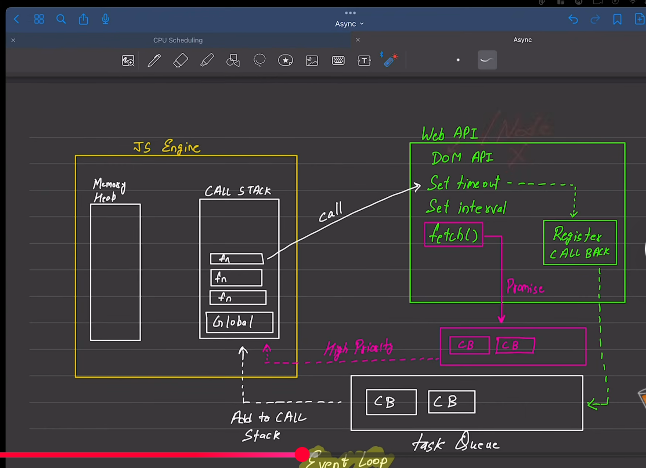

javascript is
  1.synchronous  (By Default)
  2.single thread

# Each operation waits for the last one to complete before execution.

Execution context 
execute one line of code at a time
console1
console2
call stack memoryheap

Blocking code     vs       Non Blocking code
block the flow of program  Doesn't block execution
read file sync             read file async
                           file send to database 
                              say successful
                            but something error occurs 

                            